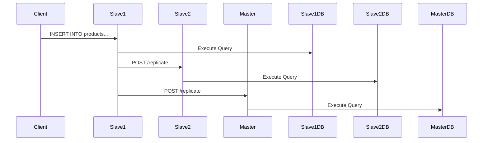

# 🛍️ E-Commerce Database Management System with Replication

## 📌 Overview

A distributed e-commerce database system with master-slave replication architecture, built with Go and MySQL. Provides complete CRUD operations for customers, products, and orders through a web interface with automatic synchronization across nodes.

## ✨ Key Features

### 🔄 Replication System

- **Master-Slave Architecture** with automatic synchronization
- **Bi-directional replication** capability
- **Conflict resolution** for data consistency
- **Real-time updates** across all nodes

### 🛒 E-Commerce Modules

| Module      | Operations                    |
| ----------- | ----------------------------- |
| Customers   | Create, Read, Update, Delete  |
| Products    | Inventory management, Pricing |
| Orders      | Processing, Cancellation      |
| Order Items | Detailed product tracking     |

### ⚙️ Technical Features

- **Pagination** for large datasets
- **Advanced search** with filters
- **Sorting** by multiple criteria
- **Database administration** tools
- **Responsive web interface**

## 🛠️ Installation Guide

### Prerequisites

- Go 1.16+
- MySQL 5.7+
- Git

### Setup Instructions


Clone the repository:

```bash
git clone https://github.com/Radwa812-Apps/ddb_final/tree/final_slave
cd ecommerce-dbms
```

Set up environment variables:

```bash
export DBUSER=your_db_username
export DBPASS=your_db_password
```

Initialize the database:

- Create a MySQL database named `ecommerce_db`
- Import the schema from `schema.sql`

Configure slave nodes:

- Update the `snaps` slice in `crud_operation.go` with slave node info
- Ensure each slave node has the replication endpoint running

In another terminal (master node):

```bash
DBPORT=8080 ./ecommerce-dbms
```

Build and run:

```bash
go build
./ecommerce-dbms
```
---

## 🌐 Usage

### Accessing the System

- Open your browser at: `http://localhost:8081`
- Use the dashboard for navigation and management

### Key Endpoints

- `/customers` - Manage customer accounts
- `/products` - Manage product inventory
- `/orders` - Process and manage orders
- `/dashboard` - E-commerce Dashboard

---

## ⚙️ Configuration

### Master Node (crud_operation.go)

```go
var snaps = []Snap{
    {
        Name:     "Alyaa-Slave", 
        Address:  "192.168.39.155",
        Port:     "8081",
        Username: "elite",
        Database: "ecommerce_db",
    },
    // Add more slave nodes as needed
}
```

### Environment Variables

| Variable | Description       | Example      |
| -------- | ----------------- | ------------ |
| DBUSER   | Database username | elite        |
| DBPASS   | Database password | securepass   |
| DBPORT   | Web server port   | 8080 or 8081 |

## 🌐 Web Interface Endpoints

### Core Routes

| Endpoint       | Description         | Methods   |
| -------------- | ------------------- | --------- |
| `/customers` | Customer management | GET, POST |
| `/products`  | Product inventory   | GET, POST |
| `/orders`    | Order processing    | GET, POST |
| `/dashboard` | System overview     | GET       |

### API Endpoints

| Endpoint        | Description                 |
| --------------- | --------------------------- |
| `/replicate`  | Replication endpoint (POST) |
| `/api/orders` | JSON order data             |

## 🔄 Replication Flow



## 📂 Project Structure

```
ecommerce-dbms/
├── crud_operation.go    # Core database operations
├── function.go          # Business logic
├── handler.go           # HTTP controllers  
├── schema.sql           # database schema
├── slave.go             # Slave node entry
├── templates/           # HTML views
│   ├── base.html
│   ├── customers.html
│   └── ...
└── README.md
```

## 🐛 Troubleshooting Guide

| Symptom                    | Solution                   |
| -------------------------- | -------------------------- |
| Replication failures       | Check network connectivity |
| Database connection issues | Verify credentials in cfg  |
| Template rendering errors  | Validate template syntax   |
| Data inconsistency         | Check replication logs     |

## 📜 License

This project is licensed under the  **MIT License** .

## 📧 Contact

📧 Email: Shaima.AbdulRahim829@compit.aun.edu.eg
🔗 GitHub: https://github.com/Radwa812-Apps

---

```bash
# Quick Start
make deploy && ./ecommerce-dbms
```

> **Note**: Ensure all nodes can communicate on the specified ports (8080 for master, 8081 for slave by default)
